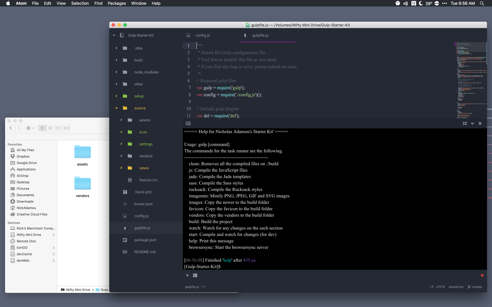

# Nicholas Adamou's Starter Kit [Gulp]


[](https://travis-ci.org/NicholasAdamou/Gulp-Starter-Kit)


## About
Gulp Starter Kit is a simple, responsive boilerplate to kickstart any responsive project.
It is built on [Skeleton](https://github.com/dhg/Skeleton), to provide a simplistic start to any web development project. This kit is built to be used in conjunction with [gulp](http://gulpjs.com/) to automate different tasks as a web developer.

## Requirements
This project does have some requirements that you will need to meet in order to compile it. First of all you need NodeJS in order to run javascript on the console, you can go to the [NodeJS](https://nodejs.org/en/) site and follow through the installation process. After you get the `npm` command on the console, you need to install Gulp and Bower globally with the following command:

```
npm install -g gulp bower
```

Gulp is the process that will run all the task of compilation, watchers, and others. Bower will get the dependencies for the client-side like jQuery. Those are the only requirements to run this project.

## Install
In order to start using this project, you need to clone/download it to your machine.

## Set Up
Now after you have cloned/downloaded the kit to a desirable location, you will need to navigate to the `Starter Kit` folder using terminal and execute the following commands to gather all the dependencies and open the `Gulp Help` screen.

```
npm run-script install-dependencies
gulp help
```
After the two processes finish, you can proceed into the `How to Use` section to understand each option the kit presents to you.

## How to use
To start using the kit, open the project on the code editor of your choice and start coding.

To compile and live-preview all of your changes, you have some commands that will help you. Here is a list of commands you should know.

Every command has to be executed on the root directory of the project using the gulp command like `gulp clean` or `gulp build`.

* **start**: Compile and watch for changes (For development)
* **clean**: Removes all the compiled files on ./build
* **js**: Compile the JavaScript files
* **jade**: Compile the Jade templates
* **sass**: Compile the Sass styles
* **images**: Copy the newer to the build folder
* **favicon**: Copy the favicon to the build folder
* **vendors**: Copy the vendors to the build folder
* **build**: Build the project
* **watch**: Watch for any changes on the each section
* **help**: Print this message
* **browserSync**: Start the browser-sync server

If you are in the development process, the `gulp start` command is the best option for you. Go to the project folder in the console and execute `gulp start`, it will compile the project and start server that will refresh every time you change something in the code. The command will be waiting for changes and will tell you how to access the project from local and public url. Every browser that points to that url will be auto refreshed. As an extra feature for testing purpose any interaction on one browser will be reflected on any others. Try it on a phone, tablet, and pc at the same time.

## Structure
The project has a very simple and flexible structure. If the default place for any file or directory needs to be moved, be sure to update the new position on the config file.

```
├───build -> All of the compiled files will be placed here (Distribution)
│   ├───assets -> Compiled Assets
│   ├───index.html -> Compiled Jade files
│   ├───vendors -> Project dependencies
├───source -> All of the un-compiled files will be placed here (Development)
│   ├───assets -> Assets for the project
│   │   ├───images -> Images
│   │   └───js -> Scripts
├───js/ -> Uncompiled Javascript directory
│   ├───functions.js -> Un-Compiled Javascript file
├───sass/ -> Uncompiled SASS directory
│   ├───partials/ -> Tools/Frameworks
│   ├───index.scss -> Uncompiled sass file
│   │   index.scss -> Main sass file, where all other sass files should be included.
│   ├───vendors -> Vendors folder for all the dependencies (Managed by Bower)
├───settings/ -> Starter Kit Settings
├───views/ -> Uncompiled Jade directory
│   ├───includes/ -> Un-Compiled Jade files to be included inside the `index.jade` file
│   │   └───partials/ -> Contains the main `_head.jade` and `_scripts.jade` file(s)
│   ├───layouts/ -> Contains the main '_layout.jade' file to be added as an 'extension' to the 'index.jade' file
│   ├───index.jade -> Un-Compiled Jade file
├───.bowerrc -> Defines where the dependencies will be installed
├───bower.json -> Bower configuration file for managing bower dependencies
├───package.json -> NodeJS configuration file for managing node dependencies
├───gulpfile.js -> Gulp tasks
├───config.js -> Project configuration
```
All the files in the build folder will be auto-generated by the different tasks when you compile the project. Be sure to not modify any files manually in the build folder because changes will be replaced in the compilation process.

## Configuration
This project has some nice configuration options to meet all you needs. To configure, you will need to edit the `config.js` file and change any value you need. Every aspect of this configuration is described in the file so that you can understand their functions.
