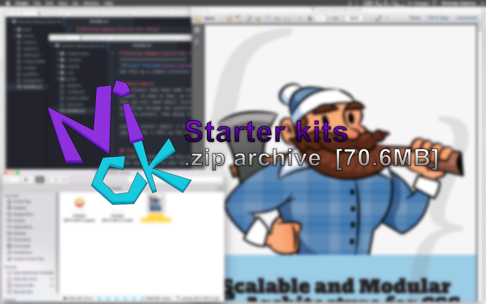

# Nicholas Adamou's Starter Kits [Gulp]



## About
Starter Kit is a simple, responsive boilerplate to kickstart any responsive project.
It is built on [Skeleton](https://github.com/dhg/Skeleton), to provide a simplistic start to any web development project.

## Requirements
This project does have some requirements that you will need to meet in order to compile it. First of all you need NodeJS in order to run javascript on the console, you can go to the [NodeJS](http://nodejs.rg) site and follow through the installation process. After you get the `npm` command on the console, you need to install Gulp and Bower globally with the following command:

```
npm install -g gulp bower
```

Gulp is the process that will run all the task of compilation, watchers, and others. Bower will get the dependencies for the client-side like jQuery. Those are the only requirements to run this project.

## Install
In order to start using this project, you need to clone/download it to your machine.

## Set Up
Now after you have cloned/downloaded the kit to a desirable location, you can choose one of the following methods of setting up the kit.

## Method One
After you have it on you machine, you will need to navigate to the project folder using terminal and execute the following command to gather all the dependencies.
```
npm run-script install-dependencies
```

## Method Two
Additionally, you can use the custom `setup` script inside the `Setup Scripts` folder, which will automate the previously mentioned information.

There are two versions, one for Mac, and one for Windows.

Both located in their respective folder labeled: `osx` or `win`.

Mac file extension: `.sh` (located in `Starter\ Kit/Setup\ Scripts/osx/`)

Windows file extension: `.bat` (located in `Starter\ Kit/Setup\ Scripts/win/`)

Choose the one that suits your OS and read its respective notes.

## Mac Version Notes

Open `Terminal.app` and navigate to `Starter\ Kit/Setup\ Scripts/`, then type the following:

`sudo bash setup.sh`. This will run the `setup.sh` shell script as `sudo`, follow the on-screen instructions.

*Note*: If you double click on the `.sh` file(s), the process will not work because the `.sh` file(s) requires `sudo` privileges.

After the process finishes, you will be prompted with the `Gulp Help` screen. Once you've reached this point, you can proceed into the `How to Use` section to understand each option the kit gives you.

## Windows Version Notes

Open the `win` folder inside the `Setup Scripts` folder and right click on the `setup.bat` file and `run as Administrator` then follow the on-screen instructions.

*Note*: If you double click on the `.bat` file(s) *without* right clicking and selecting `run as Administrator`, the process will not work because the `.bat` file(s) requires `Administrative` privileges.

After the process finishes, you will be prompted with the `Gulp Help` screen. Once you've reached this point, you can proceed into the `How to Use` section to understand each option the kit gives you.

## How to use
To start using it, the only thing you will need to do is open the project on the code editor of your choice and start coding. To compile and live preview all of your changes, you have some commands that will help you. Here are the list of commands you should know.

Every command has to be executed on the root directory of the project using the gulp command like `gulp clean` or `gulp build`

* **start**: Compile and watch for changes (For development)
* **clean**: Removes all the compiled files on ./build
* **js**: Compile the JavaScript files
* **jade**: Compile the Jade templates
* **rucksack**: Compile the Rucksack styles
* **imagemin**: Minify PNG, JPEG, GIF and SVG images
* **sass**: Compile the Sass styles
* **images**: Copy the newer to the build folder
* **favicon**: Copy the favicon to the build folder
* **vendors**: Copy the vendors to the build folder
* **build**: Build the project
* **watch**: Watch for any changes on the each section
* **help**: Print this message
* **browsersync**: Start the browsersync server

If you are in the development process, the `gulp start` command is the best option for you. Go to the project folder in the console and execute `gulp start`, it will compile the project and start server that will refresh every time you change something in the code. The command will be waiting for changes and will tell you how to access the project from local and public url. Every browser that points to that url will be auto refreshed. As an extra feature for testing purpose any interaction on one browser will be reflected on any others. Try it on a phone, tablet and pc at the same time.

## Structure
The project has a very simple and flexible structure. If the default place for any file or directory needs to be moved, be sure to update the new position on the config file.

```
├───build -> All the compiled files will be placed here (Distribution)
│   ├───assets -> Compiled Assets
│   ├───index.html -> Compiled Jade files
│   ├───vendors -> Project dependencies
├───source -> Source files for the project
│   ├───assets -> Assets for the project
│   │   ├───images -> Images
│   │   └───js -> Scripts
│   ├───sass  -> Sass styles
│   │   index.sass -> Main sass file, where all other sass files should be included.
│   ├───vendors -> Vendors folder for all the dependencies (Managed by Bower)
│   └───views -> Templates directory for Jade files
│   │   └───index.jade
├───.bowerrc -> Defines where the dependencies will be installed
├───bower.json -> Bower configuration file for managing project dependencies
├───package.json -> NodeJS configuration file for managing node dependencies
├───gulpfile.js -> Gulp Tasks
├───config.js -> Project configuration
```
All the files in the build folder will be auto-generated by the different tasks when you compile the project. Be sure to not modify any files manually in the build folder because changes will be replaced on the compilation process.

## Configuration
This project has some nice configuration options to meet all you needs. To configure, you will need to edit the `config.js` file and change any value you need. Every aspect of this configuration is described in the file so that you know the functions.
